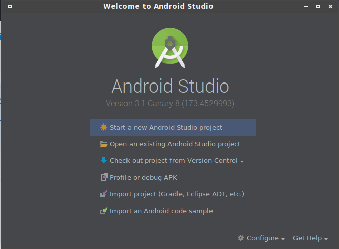

How to build 
---------------

During the development of Sikorka android application the canary version (development alpha) is usually used.

*After the first release there will be probably a build on the stable version of the AGP~(Android Gradle Plugin)~/AS ~(Android Studio)~ but the actual development will always be on canary.*

In order to be able to build the application of the development branch, first of all you have to download the preview version of Android Studio

> Download: https://developer.android.com/studio/preview/index.html

Proceed to extract Android Studio to a folder of your choice. 

If you are running Android Studio for the first time, follow the wizard to setup the SDK.

If you already have Android Studio installed then you can proceed and checkout the Sikorka application source code from github.

```bash
git clone git@github.com:Sikorkaio/android-app.git
```

The development branch is usually the most up to date branch so be sure to checkout the *development* branch.

After checking out the application's source code you should proceed opening Android Studio.

You will be greeted by the Android Studio Welcome Screen




Select the **Import project (Gradle, Eclipse ADT, etc.)** option and locate the **android-app** you previously cloned.

If you are opening the project for the first time you will probably get an error about *api-keys.properties* not existing.

You have to create a Google Maps API key on Google Console, if you don't already have an API key.

> Google Console: https://console.cloud.google.com/

> Instructions for Map API key: https://developers.google.com/maps/documentation/android-api/signup

After getting the API key go in the **android-app** folder and create the *api-keys.properties* file.

Then you have to put the API key you generated inside the *api-keys.properties* file in the following format.

```properties
google_maps_key=API_KEY_VALUE
```

After adding the Google Maps API key the sync should complete properly.

 
In case the sync fails due to missing build tools, just press the quick action (*Install Build Tools...*) to install the tools.

There is a slight chance that the plugin used during the last commit is using an outdated alpha version of the Google Android Plugin, so if you get a Dialog about Android Gradle Plugin requiring an Update you should press the **Update** button.

If you get a message about Minimum supported Gradle version, press the **Fix Gradle wrapper and re-import project**.

After syncing you should be able to build and deploy the application to a **USB connected Device** or **emulator**.

#### Kotlin Plugin Update

There is a chance that the kotlin plugin bundled with Android Studio might be a bit outdated.
If this is the case when you open the *build.gradle* in the root project directory you 
should se the entry:

```groovy
    classpath "org.jetbrains.kotlin:kotlin-gradle-plugin:$kotlin_version"
``` 
highlighted and the should be a tooltip message about the kotlin plugin version not matching 
the Gradle kotlin version.

To update the Kotlin plugin you should go to the *Tools->Kotlin->Configure Kotlin Plugin Updates*
and press the *Check for Updates Now* button and then the Install button in order to update the 
Kotlin plugin in Android Studio

### Installation

There are a few things that you should keep in mind during the installation of the development build.

If you are installing over a previous development commit of the application, you should check 
your logs for possible database errors.

In case you get errors that look related to the database schema then proceed to completely  
remove the application and do a fresh install. This will clear the application data and the
internal database.

Before reinstalling make sure if you have an account with test ether to export the account.
You can import your account again during the setup part.

*The chain data are stored in the internal storage of the device and thus the sync should 
resume from where it stopped instead of starting from scratch.*

## Deploying

When trying to deploy from linux on a usb device, keep in mind that sometimes
the device might appear like having no permissions, and it won't allow you 
to directly deploy. I will also not show you the permission dialog.

If this is the case, then go on your device's notifications and locate 
the notification *USB charging the device*. Press the notification and
select the *Transfer photos (PTP)* option. 

After selected PTP you should be able to view the device in adb,
and the permission dialog should appear properly.
