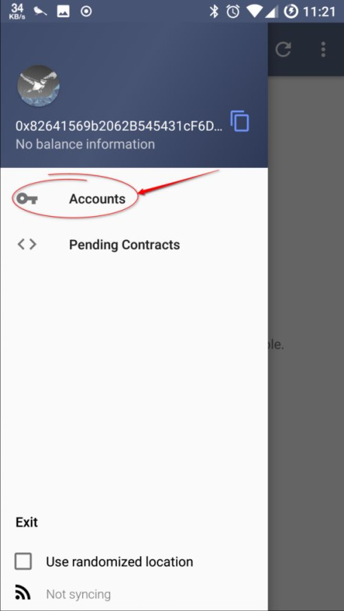
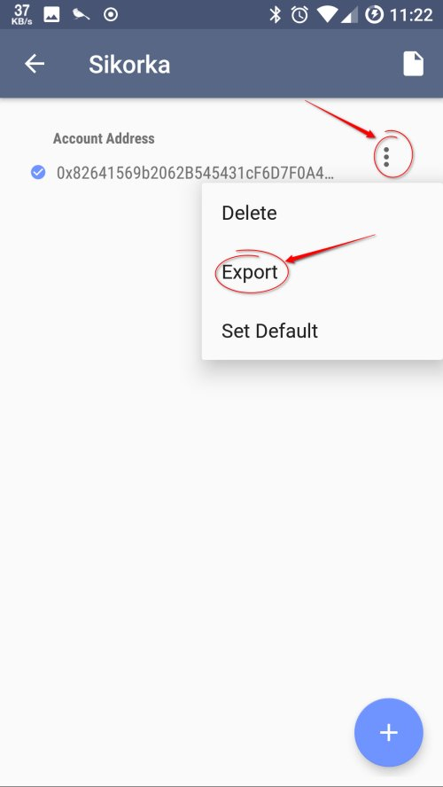
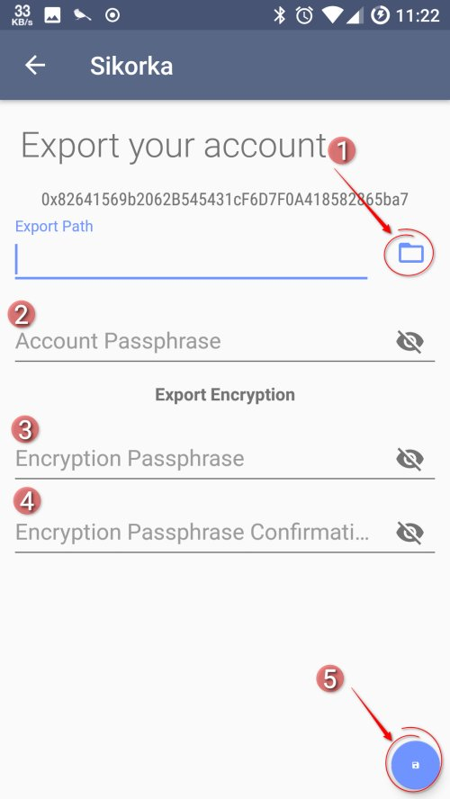
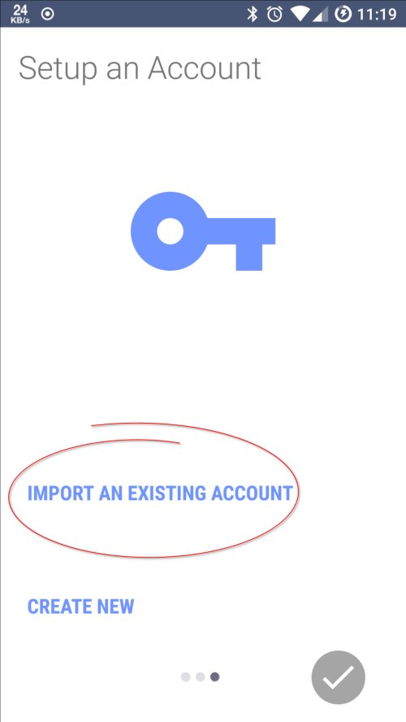
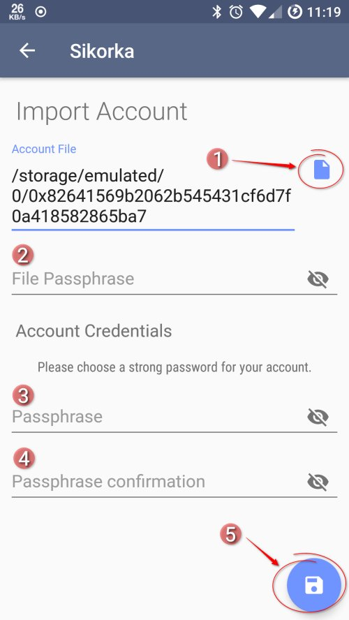
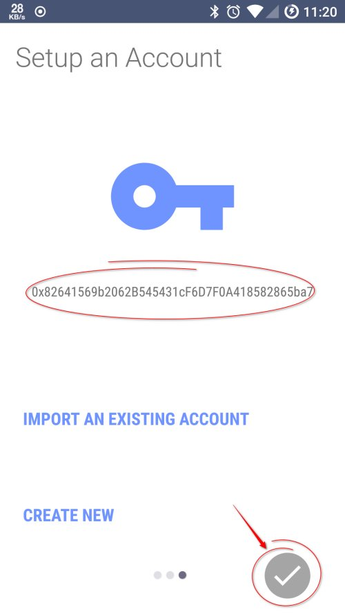

Importing and Exporting accounts
-------------------------

# Exporting an account

In order to export an account from the Sikorka application you need to open the navigation drawer and then press the **Accounts**
menu.
 

After this the accounts screen should be open. 
In the account screen go to the account entry that you want to export and press the three dot icon to open the popup menu for the specific account. On the popup menu select **Export** to open the account export screen.

At the account export screen first press the folder icon **(1)** to select the path where the account will be exported.
The exported file will be in the selected directory and the file name will be the account hash.

Then you have to enter the passphrase to unlock the account **(2)** and add a passphrase **(3)** and a confirmation **(3)** in order to encrypt the exported account key.

Finally press the save floating action button **(5)** to save the account. If everything is done you will get a message that will confirm the successful export and then you will be navigated away from the export screen.

*Any error in the inputs should display an error message under the field that had the erroneous input.*

# Importing an account

You can import an account either when setting up the application (or from the account activity mentioned above by pressing the with document icon on the action bar of the accounts screen).

To import an existing account from the wizard select the **Import an existing account**. This will start the account import screen.

At the account import screen, press the file icon button **(1)** to open the file selection dialog. Locate and choose the account file.
The full path of the account file should appear in the **Account File** input field.

Use the passphrase used to encrypt the key in the account file, to unlock the account **(2)**. 
Then insert a passphrase for the account **(3)** and the confirmation of the passphrase **(4)** in order to import the account to the application.

Finally press the save floating action button **(5)** in order to complete the account import.

If everything is fine you should return to the last screen of the wizard (or if you are importing from the accounts page, you should return to the accounts page).

*Any error in the inputs should display an error message under the field that had the erroneous input.*

After a successful import during the wizard you should be able to see the hash of the imported account on the last page of the wizard. (Or a new entry in the accounts screen). 